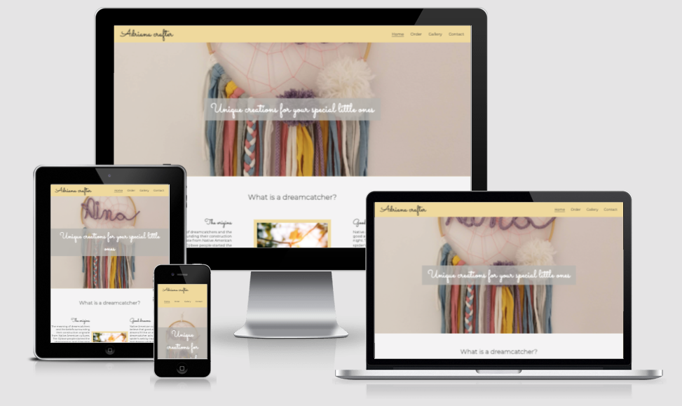
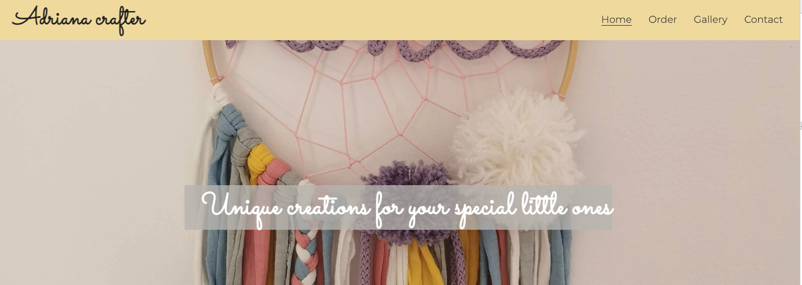
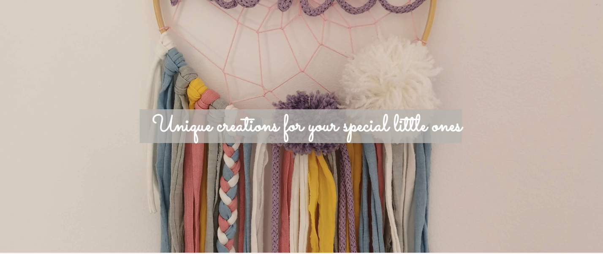
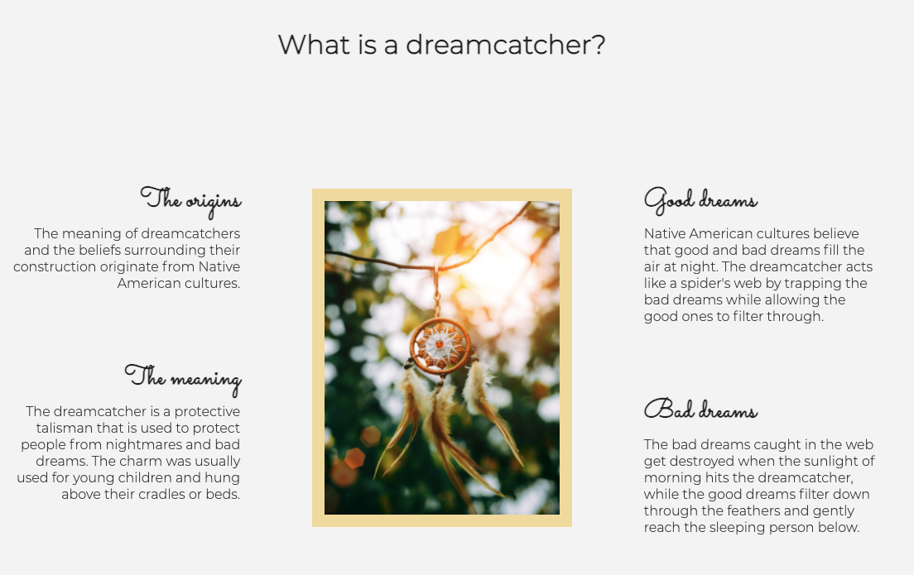
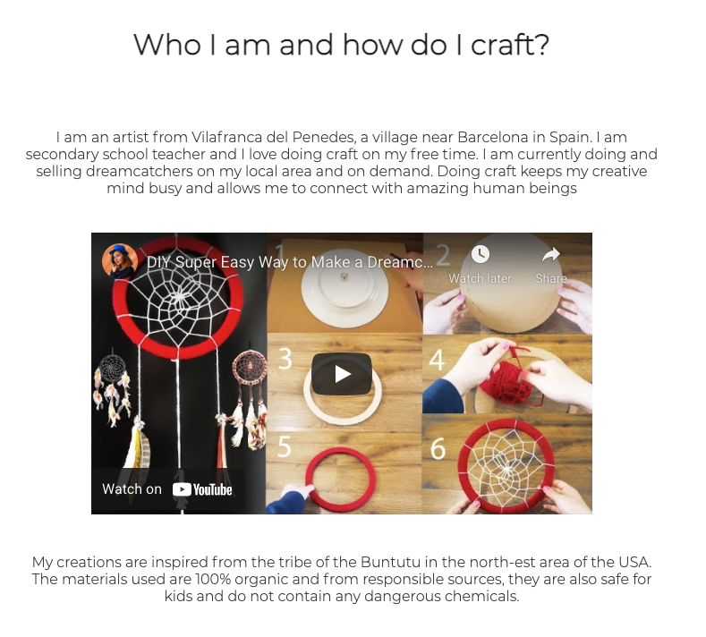
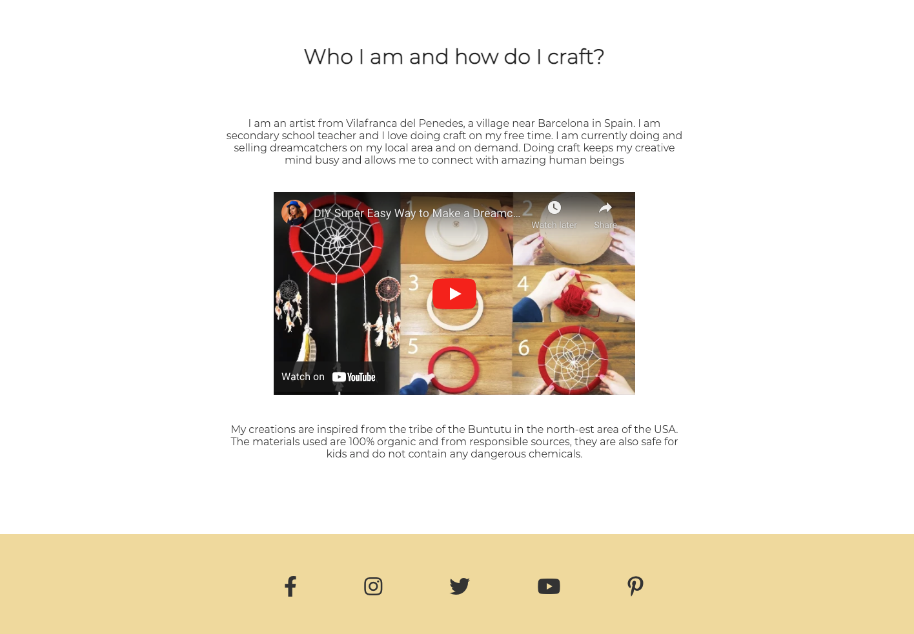
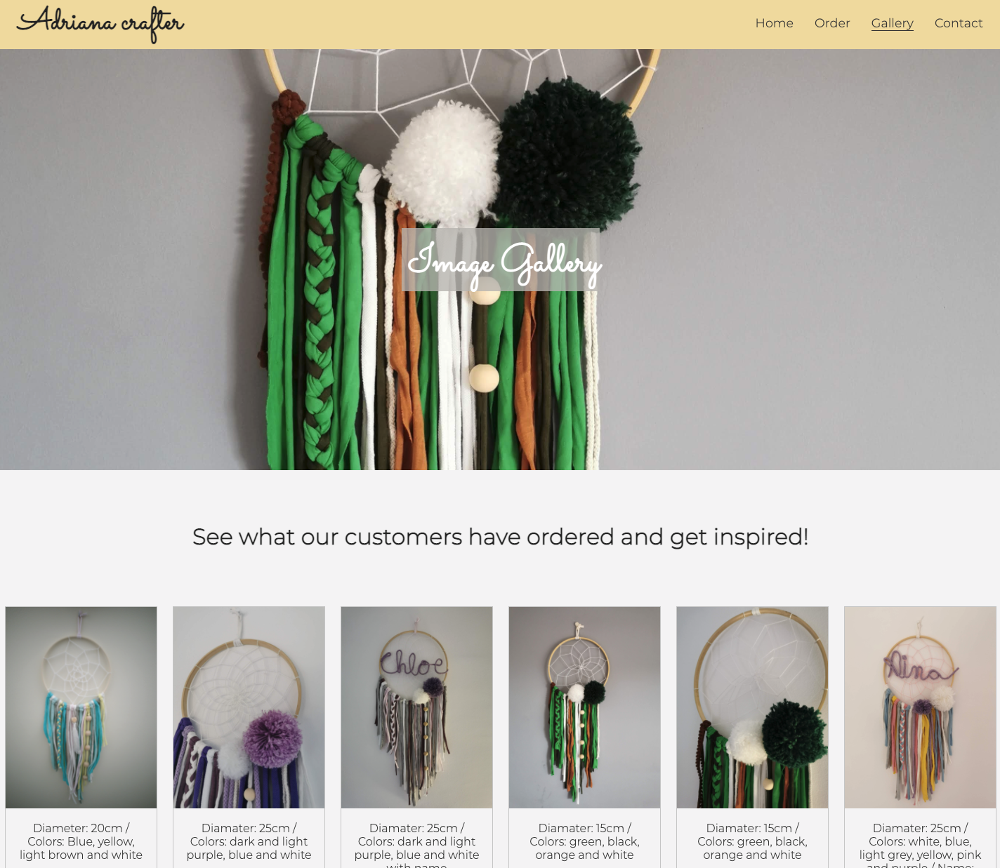
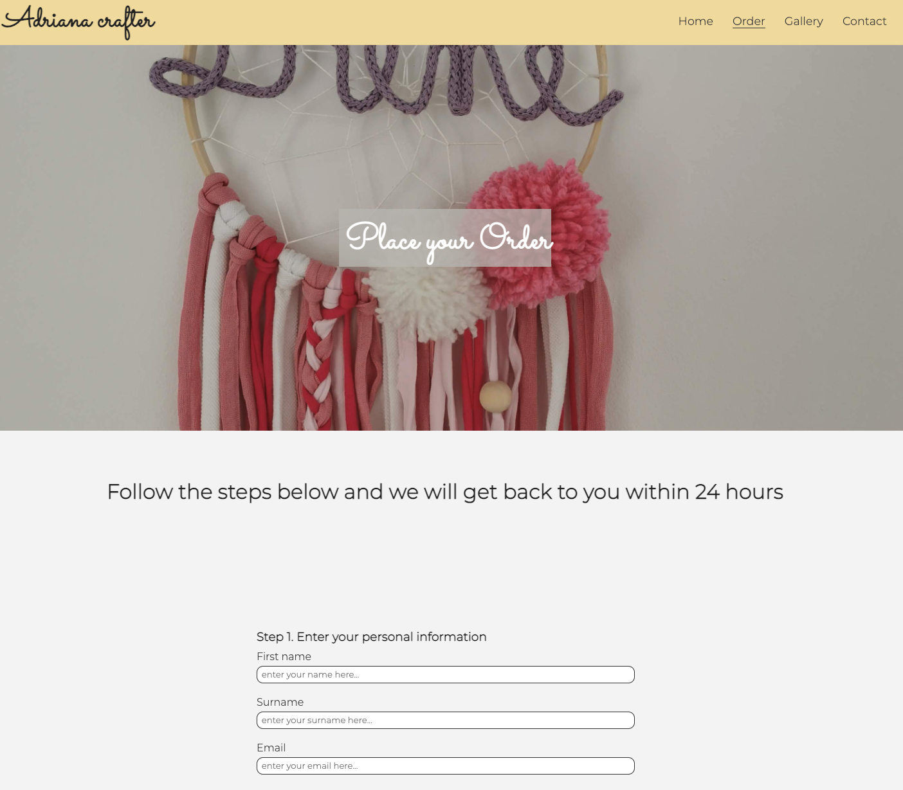
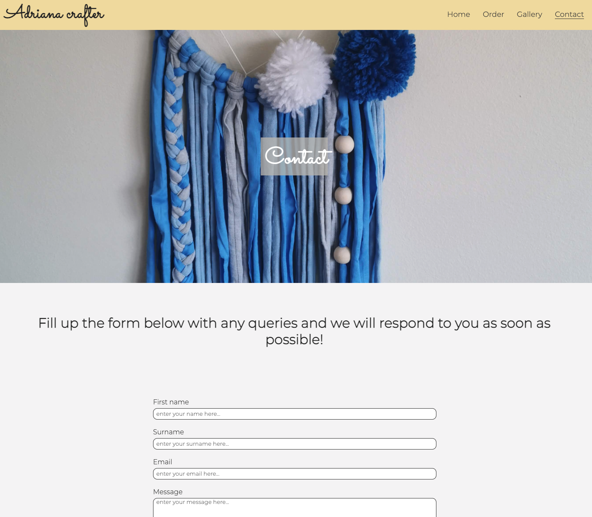

# AdrianaCrafter

[View the page on github here]

## Table of Contents

1. [Introduction](#Introduction)
2. [Features](#Features)

    i. [Navigation Bar](#Navigation-Bar)

    ii. [Landing Page Image](#Landing-Page-Image)

    iii. [Home Section](#Home-Section)

    iv. [Footer](#Footer)

    v. [Gallery](#Gallery)

    vi. [Create your Order](#Create-Your-Order)

    vii. [Contact](#Contact)

3. [Testing and Deployment](#Testing-and-Deployment)

    i. [Testing](#testing)

    ii. [Deployment](#deployment)

4. [Validator Testing](#Validator-Testing)

5. [Unfixed Bugs](#Unfixed-Bugs)

6. [Deployment](#Deployment)

7. [Credits](#Credits)

https://www.powwows.com/what-is-a-dream-catcher/s

## Introduction

This website is been built for Adriana Crafter, a local craft artist in Vilafranca del Penedes a small city near Barcelona in Spain. The primary focus of the site is to showcase and sell the dreamcatchers the artist does under request or through inspiration. The website should support the artist to expand her web-presence and the knowledge of her work beyond her local area. The artist currently works as a secondary teacher in a school and would like to increase her presence on the internet and to allow potential customers to see her craft work and potentially buy. In addition to this, this is the first of five projects of the developer´s portfolio. This particular project is aimed to demonstrate the developer's understanding of HTML5 and CSS.

## Features

This website is designed for potential customers in the local area of the artist who are looking to purchase a unique creation with a special meaning. The website also targets people interested on crafting and who wishes to purchase the artist work as well as networking.

[Back to Top](#AdrianaCrafter) 

### Navigation Bar

The Navigation Bar is featured in all the pages and allows the user to easily navigate and find what they are looking for. The menu is identical in all the pages and it includes links to the Home page, the Gallery, the Order form and the Contact page.

This section is designed for easy use for the general public of all ages and conditions.

[Back to Top](#AdrianaCrafter) 

### [Landing Page Image](index.html)

The Landing Page image is designed for any user to be able understand what is the website about and what the artist does. It welcomes the user with one the the artist's works and 
introduces them to the content.

[Back to Top](#AdrianaCrafter) 

### Home Section

The Home section of the website is divided in two differents parts:

1. Part one:
The first part of the Home section includes a picture of a dreamcatcher and a little explanation of the meaning and why it is a special gift to make to the people you love, especially kids. It introduces the user to the origins, meaning, bad dreams and good dreams. This provides an extra value to the gift as it involves it is not only materialistic but a type of protection against nightmares.

2. Part two:
The second part of the Home section introduces who the artist is and how she works. A video of how she works is attached and linked to her Youtube channel for the users to be able to see the tutorial or any other videos she might produce in the future.

[Back to Top](#AdrianaCrafter) 

### Footer

The footer is been kept as simple as possible with only the social links to the artist´s different pages. It is featured at the bottom of all the pages for consistency and for the user to be able to access them quickly and easily.

[Back to Top](#AdrianaCrafter) 

### [Gallery](gallery.html)

The gallery page showcases all the orders and jobs already done by the artist. The user can see all the images in one same page and when clicking on a particular image this one opens in a new tab. Opening in a new tab offers the user a bigger view in more detail of the dreamcatchers and can inspire them when creating their own orders.

[Back to Top](#AdrianaCrafter)

### [Create Your Order](order.html)

This page will allow the user to create their own order to the artist after getting inspiration from the gallery of images. It also provides price information and the options available as well as what to expect once the order is been sent to the artist. Note that because there is no back end related to the website when sending the form there is no repsonse.

[Back to Top](#AdrianaCrafter) 

### [Contact](contact.html)

The contact page allows the users to contact the artist with any question or request they might have. This section is more versatile and allows the user the express themselves more directly and on a more personalised way. Note that because there is no back end related to the website when sending the form there is no repsonse.

[Back to Top](#AdrianaCrafter) 

## Testing and Deployment

### Testing

### Deployment

[Back to Top](#AdrianaCrafter) 

### Validator Testing

[Back to Top](#AdrianaCrafter) 

### Unfixed Bugs

[Back to Top](#AdrianaCrafter) 

### Deployment

[Back to Top](#AdrianaCrafter) 

## Credits

[Back to Top](#AdrianaCrafter) 