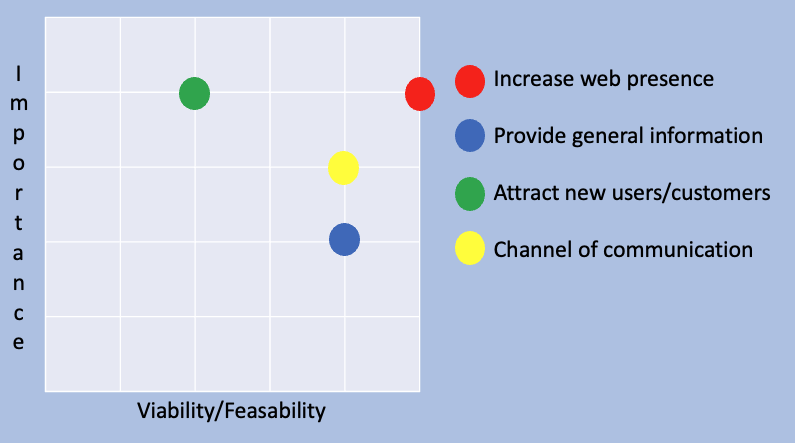
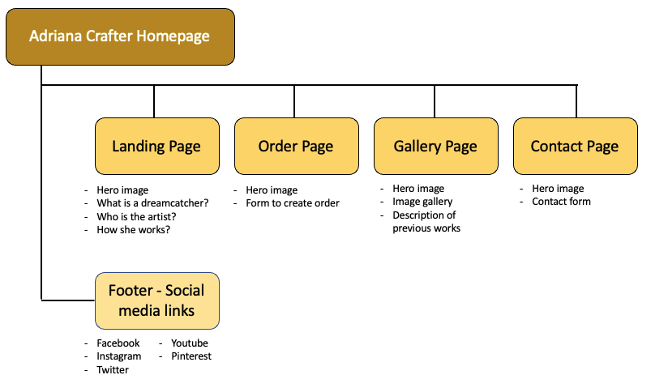

# AdrianaCrafter

[View the page on github here](https://anag0307.github.io/adriana-crafter-ii/)

## Table of Contents

1. [Introduction](#Introduction)

2. [UX](#UX)

    i. [Ideal User Demographic](#Ideal-User-Demographic)

    ii. [User Stories](#User-Stories)

    iii. [Design Planes](#Design-Planes)

3. [Features](#Features)

    i. [Navigation Bar](#Navigation-Bar)

    ii. [Landing Page Image](#Landing-Page-Image)

    iii. [Home Section](#Home-Section)

    iv. [Footer](#Footer)

    v. [Gallery](#Gallery)

    vi. [Create your Order](#Create-Your-Order)

    vii. [Contact](#Contact)

4. [Testing, Validation and Deployment](#Testing-and-Deployment)

    i. [Testing](#testing)

    ii. [Validation](#Validation)

    ii. [Deployment](#deployment)

5. [Issues and Bugs](#Issues-and-Bugs)

6. [Technologies Used](#Technologies-Used)

7. [Credits](#Credits)

***

## Introduction

This website is been built for Adriana Crafter, a local craft artist in Vilafranca del Penedes a small city near Barcelona in Spain. The primary focus of the site is to showcase and sell the dreamcatchers the artist does under request or through inspiration. The website should support the artist to expand her web-presence and the knowledge of her work beyond her local area. The artist currently works as a secondary teacher in a school and would like to increase her presence on the internet and to allow potential customers to see her craft work and potentially buy as well as networking with other artist that might show an interest.

[Back to Top ⇧](#AdrianaCrafter) 

***

## UX

### Ideal User Demographic 
#### The ideal user of this website is:
- Potential followers.
- Current social media followers.
- Followers of similar artists.
- Other craft artists.
- Amateur craft community.

### User Stories
#### New and potential users goals:
- As a new follower, I want to easily navigate through the website to find the information easily and in an intuitive way.
- As a new follower, I want to learn more about the artist, her background and what makes her craft unique.
- As a new follower, I want to easily navigate to the artist´s social media to find news about her recent works and communications.
- As a new follower, I want to easily access the artist's crafts done in the past.
- As a new follower, I want to easily create an order of my choice and inspiration.
- As a new follower, I want to easily contact the artist with any queries I might have about my order or any new collaboration, for example.

#### Current Social Media Followers
- As a current social media follower, I want to be able to contact the artist easily with any queries I might have.
- As a current social media follower, I want to be able to be up to date with new creations from the artist.
- As a current social media follower, I want to see regular updates from the artist about her new discoveries, courses she might be doing, etc.
- As a current social media follower, I want to be able to enrich my inner world through art.

#### Followers of Similar Artists
- As a follower of similar artists, I want to discover new tendencies.
- As a follower of similar artists, I want to be inspired by the creations of the artist.
- As a follower of similar artists, I want to learn new things through the artist's works.
- As a follower of similar artists, I want to discover other artists of the same or different disciplines.

#### Other Craft Artists
- As an other craft artists, I want to learn the techniques and influences of the artist.
- As an other craft artists, I want to be able to get in touch with the artist.
- As an other craft artists, I want to get regular updates of the artist's crafts.
- As an other craft artists, I want to get inspired but the artist crafts.
- As an other craft artists, I want to network with the artist and her own network.

#### Amateur Craft Community
- As part of the amateur craft community, I want to be able to learn how to craft.
- As part of the amateur craft community, I want to get information about craft materials.
- As part of the amateur craft community, I want to be able to contact and interact with the artist to ask for advice.
- As part of the amateur craft community, I want to be able to contact and interact with other members of the community.

[Back to Top ⇧](#AdrianaCrafter) 

***

### Design Planes

In order to create a comprehensive and informative website, the developer worked with the artist to define what were the needs of the artist and the required functionality of the site. The users described above were taken into account.

#### **Strategy**

##### Who is this website for and what does it do?

1. Demographics:
    1. Current and new followers.
    2. Mainly women aged between 25-30 years and over.
    3. People with the wish to make a special gift to their kids or their friend's kids.
    4. People who wishes to learn how to craft.

2. Functional Requirements:
    1. Information is accessed easily and in an simple way.
    2. The user can create an order and shop.
    3. The user can contact the artist.
    4. Find the artist's on the different social platforms.

3. Benefits for the artist:
    1. Build an online presence.
    2. Have all the information about the artist, her works and social media all in one place.
    3. Be able to sell her products.
    4. Be able to be contacted in an easy and simple way.

4. Importance/Feasability Curve

#### **Scope**

In order to align the features defined in the strategy section, the scope was divided in two categories:

- **Content Requirements**

The user will be looking for:

- General information about the product.
- See what previous works the artist has done.
- Information about the artitst.
- A way to contact the artist directly.
- A way to personalise and purchase the product.
- New works/information about the artist and her work.

- **Functionality Requirements**

The user will be able to:

- Easily navigate through the site.
- Easily purchase the product.
- Easily ask any enquiries.
- Easily find the different social platforms the artist uses.
- See previous works done by the artist.

#### **Structure**

The website is been organised in a way the user can find the different sections in a strcutured but also relevant way. The results are as follows:

#### **Skeleton**

How is the information represented and how does the user find such information:

- The Home page introduces the user to the meaning of dreamcatchers and their origins.
- The navigation bar is clear and simple for the user to understand what they will find in each page.
- The order page contains a form easy to understand and fill up to create orders.
- The gallery page contains all the main works from the artist and a quick description of them.
- The contact page is simple and quick to fill up.
- The footer contains icons representing the different social media platforms used by the artist.
- Wireframe mockups were created in [Figma](https://www.figma.com/file/4gvaJsObFnVYV8VWdcqqP2/Adriana-Crafter?node-id=0%3A1 "Link to Figma") to ensure the structure represented all the requirements described above (different versions were created).

#### **Surface**

The website needed a simple yet a fresh look that represents the personality of the artist but at the same time allowing the user to be able to easily navigate and find what they are looking for:

- The main targeted user as described above will expect simple, modern and clear features arranged in a way they can use and understand them intuitively.

- The colors used on the website is mainly the yellow already used on the logo created by the artist. This allows consistency as well.

- The fonts chosen were Sacramento for the logo (as already used in the logo designed by the artist) and Monsterrat for the rest of text, titles and buttons. This provided consistency as well. 

- The navigation is been designed in an efficient way at the same time as providing functionality.

[Back to Top ⇧](#AdrianaCrafter) 

***

## Features

This website is designed for potential customers in the local area of the artist who are looking to purchase a unique creation with a special meaning. The website also targets people interested on crafting and who wishes to purchase the artist work as well as networking.

### [Navigation Bar](index.html)

The Navigation Bar is featured in all the pages and allows the user to easily navigate and find what they are looking for. The menu is identical in all the pages and it includes links to the Home page, the Gallery, the Order form page and the Contact page.

This section is designed for easy use for the general public of all ages and conditions.

### [Landing Page Image](index.html)

The Landing Page image is designed for any user to be able understand what is the website about and what the artist does. It welcomes the user with one of the artist's works and 
introduces them to the content.

### [Home Section](index.html)

The Home section of the website is divided in two differents parts:

1. Part one:
The first part of the Home section includes a picture of a dreamcatcher and a little explanation of the meaning and why it is a special gift to make to the people you love, especially kids. It introduces the user to the origins, meaning, bad dreams and good dreams. This provides an extra value to the gift as it involves it is not only materialistic but a type of protection against nightmares.

2. Part two:
The second part of the Home section introduces to who the artist is and how she works. A video of how she works is attached and linked to her Youtube channel for the users to be able to see the tutorial or any other videos she might produce in the future.

### [Footer](index.html)

The footer is been kept as simple as possible with only the social media links to the artist´s different pages. It is featured at the bottom of all the pages for consistency and for the user to be able to access them quickly and easily.

### [Gallery](gallery.html)

The gallery page showcases all the orders and jobs already done by the artist. The user can see all the images in one same page and when clicking on a particular image this one opens in a new tab. Opening in a new tab offers the user a bigger view in more detail of the dreamcatchers and can inspire them when creating their own orders.

### [Create Your Order](order.html)

This page will allow the user to create their own order to the artist after getting inspiration from the gallery of images. It also provides price information and the options available as well as what to expect once the order is been sent to the artist. Note that because there is no back end related to the website, when sending the form there is no repsonse and the page refreshes itself.

### [Contact](contact.html)

The contact page allows the users to contact the artist with any question or requests they might have. This section is more versatile and allows the user to express themselves more directly and on a more personalised way. Note that because there is no back end related to the website when sending the form there is no repsonse and the page refreshes itself.

[Back to Top ⇧](#AdrianaCrafter) 

***

## Testing and Deployment

### Testing

General testing [video on Youtube (external link)](https://www.youtube.com/watch?v=2ksSugzuVXw&list=PLbC7Bm_Rl5cs1FEHnFW7QnfA2k8t_7lSw&index=1 "Adriana Crafter general testing video"). The observations are as follows:

- Links in the navigation bar worked fine and opened the correct page.
- Links to social media platforms in all pages worked fine and opened in a separate tab.
- Hover elements on all pages worked correctly (navigations bar, social media links, forms buttons and images from the gallery).
- Video embeded from Youtube played fine and control buttons as well.
- In the order and contact forms the information couldn't be sent if all the required information was not entered or not entered correctly (such as name, surname, email, message, colors and size).
- The pages with a form refreshes themselves (no backend is present as explained above and this is expected to happen).
- Images from the gallery are opening in a separate tab.
- Navigation bar sticks to the top of the page when scrolling down.

Responsiveness testing [video on Youtube (external link)](https://www.youtube.com/watch?v=SLc_xx3SDB0 "Adriana Crafter responsiveness testing video"). The observations are as follows:
- The website is responsive on medium screens, all the observations made above can be applied to this type of screens.
- For small screens the responsiveness was satisfactory as well but with small issues that are described below in the "Issues and BugS" section. 

### Validation

No errors have been found when checking HTML and CSS code. To validate the code the developer has used:

- [Jigsaw](https://validator.w3.org/ "link to the validator website for CSS")

- [W3C](https://validator.w3.org/#validate_by_input "link to the validator website for HTML")

### Deployment

This project was developed using [Visual Studio Code Insiders](https://code.visualstudio.com/insiders/ "Link to Visual Studio Code site") and all commit/push commands were performed in the software's terminal.

#### Github Pages

1. Log into [GitHub](https://github.com/ "link to GitHub website").

2. Select the repositery to deploy.

3. Click on Settings tab.

4. Scroll down to the GitHub Pages section under Source and open it, it will open in a different tab.

5. Select "Branch: master" and then on the new dropdown menu that will appear select "/(root)" and click Save.

6. The "Github Pages" section now contains a link to the deployed page.

#### Forking the Repository

1. Log into [GitHub](https://github.com/ "link to GitHub website").

2. Select the repository to fork.

3. Click on "Fork".

[Back to Top ⇧](#AdrianaCrafter) 

***

### Issues and Bugs

The issues stated below couldn't be fixed on time before project submission.

When testing the website the developer realised the following issues when checking the website on screens smaller than 700px:

1.  Problem: on the home page the What is a Dreamcatcher section the text is not aligned (it slightly floats to the right and to the left) and the space between the section title and the text is too big.

What is been tried to fix the issue: all the margins, paddings, widths and any option that might affect the positioning have been revised in all media queries and in the main CSS code with no luck. What the developer has learned from this issue is to keep the code as simple as possible in order to allow this developer, or any other developer that might need to, to fix the code in an easy and simple way. 

2. Problem: in the order page, in "STEP.3" the color options are not completely responsive and do not break down in pairs (the text "color" with the related drop down menu).

What is been tried to fix the issue: the developer has tried to use Flex to control the positioning of the boxes with no luck. Flex is a great tool to make the website responsive but it has its limitations, more experimenting using Flex will be unvaluable on using it in the future.

[Back to Top ⇧](#AdrianaCrafter) 

***

## Technologies Used

### Main Languages Used

- [CSS](https://en.wikipedia.org/wiki/CSS)

- [HTML](https://en.wikipedia.org/wiki/HTML)

### Frameworks, Libraries and Programs Used

- [Font Awesome](https://fontawesome.com/ "Link to FontAwesome") was used for the social media links on the footer of the page.
- [Unicorn Revealer](https://chrome.google.com/webstore/detail/unicorn-revealer/lmlkphhdlngaicolpmaakfmhplagoaln "link to Unicorn Revealer") was used to identify the overflows on the website.
- [GitHub](https://github.com/ "Link to GitHub") was used to store the project.
- [Figma](https://www.figma.com/ "Link to Figma homepage") was used to create the wireframes during the design phase of the project.
- [Am I Responsive?](http://ami.responsivedesign.is/# "Link to Am I Responsive Homepage") was used to see responsive design throughout the process and to generate mockup imagery to be used on README file.
- [Unsplash](https://unsplash.com/ "link to Unsplash") was used for the picture used in the Whats is A dreamcatcher section.

[Back to Top ⇧](#AdrianaCrafter) 

***

## Credits

### Code

The below sites were consulted by the developer to better understand HTML and CSS code. Any code used from those sites have been carefully referenced with the code.

The sites consulted are:

- [w3Schools](https://www.w3schools.com/ "link to w3s")

- [CSS Tricks](https://css-tricks.com/ "link to CSS Tricks")

- [Stack Overflow](https://stackoverflow.com "link to Stack Overflow")

### Media

With the exception of the image sourced from [Unsplash](https://unsplash.com/ "link to Unsplash") the rest of the images and video were sourced by the artist from her own work.

[Back to Top ⇧](#AdrianaCrafter) 

### Acknowledgements

- Thank you to my friends and family who patiently checked the website every time I requested them to do and provided the best feedback and support they could.
- Thank you to Adriana, the artist, who was as excited as myself to go through the project and created all the images and videos to make the site complete.
- Thank you to my mentor, Seun, for her help and support through my first steps as a developer on my first project.

[Back to Top ⇧](#AdrianaCrafter) 